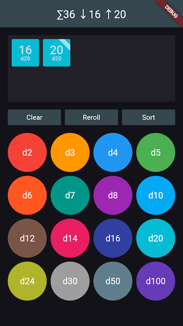

# Dice Roller

A simple Flutter app to roll "funky dice" created in one hour.

See the article below.

---
---
---

One hour till game night and I forgot to bring my dice.

So let's create a simple dice roller app in Flutter.

This is a dramatic recreation of a real story from a few years ago, but I have adapted the code to the current version of Flutter.

We've got 60 minutes, so let's get started:

    flutter create diceroller --empty --platforms=web

I imagine a single-page app that has a grid of buttons similar to a calculator, representing different dice types, and a region above those buttons to show the results of rolling the dice if buttons are tapped. All results are accumulated. Tapping a result will remove it from the display. This way, it's easy to roll 1d6+1d8 or 2d20 or whatever combination of dice is needed. I expect the user to interpret the results as required by the game rules.

Typical dice are d4, d6, d8, d10 and d20. But I want to support [Dungeon Crawl Classics](https://en.wikipedia.org/wiki/Dungeon_Crawl_Classics) (DCC), which uses even more funky dice: a d2, d3, d5, and d7 should be supported too. I think there's no d9, but a d12, d14, d16, and d24. For games like [Call of Cthulhu](https://en.wikipedia.org/wiki/Call_of_Cthulhu_(role-playing_game)), we have to support the d100. And while we're at it, and because a 4x4 grid should look best, I'll also add a d30 and a d50.

To represent a die, I use a `Die` class:

    class Die {
      Die(this.sides, this.color);

      final int sides;
      final Color color;
    
      ...
    }

This way, I can assign a color to each kind of die to make them easier to distinguish in the UI. Because I won't be able to draw them with individual outlines – especially as I want to support the funky DCC dice – those colors will come handy.

Next, let's define all `dice`:

    class Die {
      ...

      static final dice = [
        Die(2, Colors.red),
        Die(3, Colors.orange),
        Die(4, Colors.blue),
        Die(5, Colors.green),
        Die(6, Colors.deepOrange),
        Die(7, Colors.teal),
        Die(8, Colors.purple),
        Die(10, Colors.lightBlue),
        Die(12, Colors.brown),
        Die(14, Colors.pink),
        Die(16, Colors.indigo.shade700),
        Die(20, Colors.cyan),
        Die(24, Colors.lime.shade700),
        Die(30, Colors.grey),
        Die(50, Colors.blueGrey),
        Die(100, Colors.deepPurple),
      ];

      ...
    }

54 minutes left. I can't spend too much time on these colors. They must not be too bright, because I want to use white text – and using both white and black text looks inconsistent, IMHO.

To represent a die result, I use a `DieResult` class. It refers to the die used to roll it, so I have access to the color and I know whether the maximum value was rolled or not.

    class DieResult {
      const DieResult(this.die, this.result);

      final Die die;
      final int result;

      bool get isMin => result == 1;
      bool get isMax => result == die.sides;
    }

 I'm using (an insecure) random source for actually rolling the dice.

    class Die {
      ...

      static final random = Random();

      DieResult roll() => DieResult(this, random.nextInt(sides) + 1);
    }

51 minutes. Who needs dependency injection if a global variable can also do the trick. So `model` is a value notifier to display a list of die results.

    final model = ValueNotifier<List<DieResult>>([
      // just to test this, replace with [] later
      Die.dice[4].roll(),
      Die.dice[6].roll(),
      Die.dice[7].roll(),
      Die.dice[8].roll(),
    ]);

Here's my "business logic" added to my "domain model":

    extension on ValueNotifier<List<DieResult>> {
      void add(Die die) => value = [...value, die.roll()];

      void remove(DieResult result) {
        value = value.toList()..remove(result);
      }
    }

47 minutes. I need to start with the app. This is just the existing boilerplate code with a dark theme added:

    void main() {
      runApp(const MainApp());
    }

    class MainApp extends StatelessWidget {
      const MainApp({super.key});

      @override
      Widget build(BuildContext context) {
        return MaterialApp(
          theme: ThemeData.dark(),
          home: DiceRoller(),
        );
      }
    }

And here's the `DiceRoller` widget:

    class DiceRoller extends StatelessWidget {
      const DiceRoller({super.key});

      @override
      Widget build(BuildContext context) {
        return Scaffold(
          appBar: AppBar(
            foregroundColor: Colors.white,
            backgroundColor: Colors.blueGrey.shade800,
            title: Text('Dice Roller');
          ),
          body: Column(
            crossAxisAlignment: CrossAxisAlignment.stretch,
            children: [
              ResultsBox(),
              Expanded(
                child: DieButtonGrid(),
              ),
            ],
          ),
        );
      }
    }

These are placeholders fow now:

    class ResultsBox extends StatelessWidget {
      const ResultsBox({super.key});

      @override
      Widget build(BuildContext context) {
        return Container();
      }
    }

    class DieButtonGrid extends StatelessWidget {
      const DieButtonGrid({super.key});

      @override
      Widget build(BuildContext context) {
        return Container();
      }
    }

Now let's start the app for the first time and check whether anything is displayed. Since I'm building a webapp that should run on a mobile device, make sure to open the Chrome dev tools and activate the iPhone or Android mode to get a feeling for the available space. Thanks to Flutter's hot reload feature, this should be the one and only time, I actually start my app.

43 minutes. The `DieButtonGrid` should display the 16 buttons to add dice to the `ResultsBox`. I tweaked the font size, the paddings and spacing and number of columns until I was satisfied, based on an iPhone 13, because that's the device I own.

    class DieButtonGrid extends StatelessWidget {
      const DieButtonGrid({super.key});

      @override
      Widget build(BuildContext context) {
        return GridView.count(
          crossAxisCount: 4,
          padding: const EdgeInsets.all(16),
          mainAxisSpacing: 8,
          crossAxisSpacing: 8,
          children: [
            ...Die.dice.map((die) => DieButton(die: die)),
          ],
        );
      }
    }

Also, I actually wrote everything in a single `build` method and only refactored the code later, because I'm not that good to create a perfect top-down structure in my head. I didn't bother to extract the button colors into a theme, though.

Here's the button that will add a new result to the model to show it in the `ResultsBox`:

    class DieButton extends StatelessWidget {
      const DieButton({super.key, required this.die});

      final Die die;

      @override
      Widget build(BuildContext context) {
        return ElevatedButton(
          style: ElevatedButton.styleFrom(
            padding: EdgeInsets.zero,
            backgroundColor: die.color,
            foregroundColor: Colors.white,
            textStyle: TextStyle(fontSize: 18),
          ),
          onPressed: () => model.add(die),
          child: Text('d${die.sides}'),
        );
      }
    }

37 minutes. Time is running out. I have to display the results and it took me quite some time to tweak everything to look at least decent. After some trial and error, I settled on 56x56 point for the `Result` widget size. To make my UI to handle a large number of dice (I like to play [Vaesen](https://en.wikipedia.org/wiki/Vaesen_(RPG)) and other games from Free League which use a d6 dice pool), the `ResultsBox` will have to grow. But to avoid a cluttered UI, I use a hardcoded minimum size for two rows of die results.

    class ResultsBox extends StatelessWidget {
      const ResultsBox({super.key});

      @override
      Widget build(BuildContext context) {
        return ListenableBuilder(
          listenable: model,
          builder: (context, _) => Container(
            color: Theme.of(context).colorScheme.surfaceContainer,
            constraints: BoxConstraints(minHeight: 56 * 2 + 8 + 16),
            padding: EdgeInsets.all(8),
            margin: EdgeInsets.all(16),
            child: Wrap(
              spacing: 8,
              runSpacing: 8,
              children: [
                ...model.value.map((result) => Result(result)),
              ],
            ),
          ),
        );
      }
    }

Initially I called this widget `DieResult`, wondering why this didn't work, only then remembering that I already called by model by this name. So, it's just a `Result` which is a rather bad name. Time was too short to find a better one.

I noticed that just using the color wasn't enough to know which kind of die was rolled, so I added the type as a label. While testing the UI, I noticed that a 100 result of the d100 didn't fit the widget, so I added a `FittedBox`. This was probably the leg of the journey that took the most time.

    class Result extends StatelessWidget {
      const Result(this.result, {super.key});

      final DieResult result;

      @override
      Widget build(BuildContext context) {
        return FilledButton(
          style: FilledButton.styleFrom(
            backgroundColor: result.die.color,
            foregroundColor: Colors.white,
            shape: RoundedRectangleBorder(
              borderRadius: BorderRadius.circular(2),
            ),
            padding: EdgeInsets.all(4),
            fixedSize: Size(56, 56),
          ),
          onPressed: () => model.remove(result);
          child: Column(
            mainAxisAlignment: MainAxisAlignment.center,
            children: [
              FittedBox(
                child: Text(
                  '${result.result}',
                  style: Theme.of(context).textTheme.headlineSmall?.copyWith(height: 1),
                ),
              ),
              Text(
                'd${result.die.sides}',
                style: Theme.of(context).textTheme.labelSmall?.copyWith(height: 1),
              ),
            ],
          ),
        );
      }
    }

27 minutes. The app is basically ready to use. But it can be improved. Clearing the result box by tapping all results is cumbersome. So I should add a some commands. Besides a "clear" button, I'll also add a "reroll" button and a "sort" button. This is handy if you need to find the best (or worst) result fast.

I extend my "business logic":

    extension on ValueNotifier<List<DieResult>> {
      void clear() => value = [];

      void sort() {
        value = [...value]..sort((a, b) => a.result.compareTo(b.result));
      }

      void reroll() {
        value = [...value.map((r) => r.die.roll())];
      }
    }

Then I add a `Commands` widget to the `DiceRoller` between the results box and the button grid:

    class DiceRoller extends StatelessWidget {
            ...
            children: [
              ResultsBox(),
              Commands(),
              Expanded(
                child: DieButtonGrid(),
              ),
            ],
    
And here's the implementation (tweaking the button style to my liking did cost most of the time):

    class Commands extends StatelessWidget {
      const Commands({super.key});

      @override
      Widget build(BuildContext context) {
        return Padding(
          padding: const EdgeInsets.symmetric(horizontal: 16),
          child: Row(
            spacing: 8,
            children: [
              Expanded(
                child: CommandButton(
                  onPressed: model.clear,
                  label: Text('Clear'),
                ),
              ),
              Expanded(
                child: CommandButton(
                  onPressed: model.reroll,
                  label: Text('Reroll'),
                ),
              ),
              Expanded(
                child: CommandButton(
                  onPressed: model.sort,
                  label: Text('Sort'),
                ),
              ),
            ],
          ),
        );
      }
    }

    class CommandButton extends StatelessWidget {
      const CommandButton({super.key, required this.onPressed, required this.label});

      final VoidCallback? onPressed;
      final Widget label;

      @override
      Widget build(BuildContext context) {
        return FilledButton(
          style: FilledButton.styleFrom(
            backgroundColor: Colors.blueGrey.shade800,
            foregroundColor: Colors.white,
            shape: RoundedRectangleBorder(
              borderRadius: BorderRadius.circular(2),
            ),
            padding: EdgeInsets.all(8),
          ),
          onPressed: onPressed,
          child: label,
        );
      }
    }

21 minutes. That title bar is wasting space. In case that there are multiple dice, let's display the sum, as well as the minimum and the maximum value so the user doesn't have to do this math theirselves (NB littered the business logic into the UI which is bad):

    class DiceRoller extends StatelessWidget {
        ...
          appBar: AppBar(
            foregroundColor: Colors.white,
            backgroundColor: Colors.blueGrey.shade800,
            title: ListenableBuilder(
              listenable: model,
              builder: (context, _) {
                final results = model.value;
                if (results.length < 2) {
                  return Text('Dice Roller');
                }
                final sum1 = results.fold(0, (previousValue, element) => previousValue + element.result);
                final min1 = results.fold(1 << 31, (previousValue, element) => min(previousValue, element.result));
                final max1 = results.fold(0, (previousValue, element) => max(previousValue, element.result));
                return Text('∑$sum1 ↓$min1 ↑$max1');
              },
            ),
          ),
        ...

Next, I'd like to mark maximum results. But with 16 minutes left, I cannot come up with a great plan. So, for a quick and dirty soltion, I wrap the `Result` with a `CustomPaint` and simply draw a badge. In my head this looked better than it eventually turned out, but I have no second try. I tweaked the size of the badge and probably should have used named constant here.

    class BadgePainter extends CustomPainter {
      final _paint = Paint()..color = Colors.white60;

      @override
      void paint(Canvas canvas, Size size) {
        canvas
          ..translate(size.width, 0)
          ..drawPath(
              Path()
                ..moveTo(-24, 0)
                ..lineTo(0, 24)
                ..lineTo(0, 12)
                ..lineTo(-12, 0)
                ..close(),
              _paint);
      }

      @override
      bool shouldRepaint(BadgePainter oldDelegate) => false;
    }

Only 9 minutes left. There's one last thing I'd like to add. Long pressing a `DieButton` should open up a menu that provides a way to add multiple results at once. This will help with playing a dice pool system. 

Also, because I really like [Savage Worlds](https://en.wikipedia.org/wiki/Savage_Worlds), which has exploding dice, I want to implement this feature too. A die is said to explode if the result is the maximum value. Then, the die is rolled again and that result is added, too. I thought about grouping these dice, but that would mess with the `Wrap` and I gave up that idea.

Here's a really ugly popup dialog (because a popup menu got too long and I wanted multiple columns), that allows for rolling 1dX to 12dX, and optionally explode them.

    class DieDialog extends StatelessWidget {
      const DieDialog(this.die, {super.key});

      final Die die;

      // yeah, another global variable ...
      static final exploding = ValueNotifier(false);

      @override
      Widget build(BuildContext context) {
        return Dialog(
          backgroundColor: die.color,
          clipBehavior: Clip.antiAlias,
          child: Column(
            crossAxisAlignment: CrossAxisAlignment.stretch,
            mainAxisSize: MainAxisSize.min, // otherwise the dialog is too large
            children: [
              // this should be its own widget
              ListenableBuilder(
                  listenable: exploding,
                  builder: (context, _) {
                    return TextButton.icon(
                      style: TextButton.styleFrom(
                        foregroundColor: Colors.white,
                        iconColor: Colors.white,
                        fixedSize: Size.fromHeight(40),
                      ),
                      onPressed: () {
                        exploding.value = !exploding.value;
                      },
                      icon: exploding.value //
                          ? Icon(Icons.check_box)
                          : Icon(Icons.check_box_outline_blank),
                      label: Text('Exploding dice'),
                    );
                  }),
              // yeah, don't hardcode all those values
              for (var i = 1; i <= 12; i += 3)
                Row(
                  children: [
                    for (var j = 0; j < 3; j++)
                      Expanded(
                        // this should be its own widget
                        child: TextButton(
                          style: TextButton.styleFrom(
                            foregroundColor: Colors.white,
                            fixedSize: Size.fromHeight(40),
                          ),
                          onPressed: () {
                            _roll(i + j);
                            Navigator.pop(context);
                          },
                          child: Text('${i + j}d${die.sides}'),
                        ),
                      ),
                  ],
                ),
            ],
          ),
        );
      }

      void _roll(int n) {
        for (var i = 0; i < n; i++) {
          model.add(die);
          if (exploding.value && model.value.last.isMax) {
            _roll(1);
          }
        }
      }
    }

With just 1 minute left, I quickly add an `onLongPress` property to the die button widget:

    class DieButton extends StatelessWidget {
        ...
        onPressed: () => model.add(die),
        onLongPress: () {
          showDialog<void>(context: context, builder: (_) => DieDialog(die));
        },

And the only thing left to do it deploy the app to some website so that I can access it from my iPhone and add it to my home screen so it looks like any other app.

When I originally wrote this, I used Vercel, then still called "now" which had a `now` CLI command that could be used to host any folder with a static `index.html` with a single CLI command. Feel free to use any service you like. Github pages seems to be a good option.

If you want to extend the app, here are some ideas. 

+ Rerolling should not reroll the exploded dice, just the original once and of course explode dice again. This could be done by adding an `exploded` flag to `DieResult`.
+ Mark not only the maximum values, but also the minimum values, because for example Modiphius' [Star Trek](https://en.wikipedia.org/wiki/Star_Trek_Adventures) uses 1 as a critical success.
+ And whole you're on it, also mark the exploded dice.
+ Then, allow the user to switch from the dice grid to a list of preconfigured die rolls (which can be edited of course) that are be specified using the usual notation like `2d20+1` with extensions like `4d6kh3` which shall mean that from rolling 4 six-sided dice I want to keep the highest 3 or `10d6cs=6` which shall mean that I roll 10 six-sided dice and then count the number of dice that show a six.
+ Add some dice rolling animations.
+ Make those dice 3D.
+ Roll them if you shake your phone.
+ Provide presets for different TTRPG systems.
+ Make it understand spoken commands like "roll three-d-six, drop the lowest result." and let the app (or an AI) transform this into `3d6dl1` or "roll d20 plus 7 with advantage" and transform this into `2d20kh1+7`.
+ Make it answer by voice: "I rolled two d20, the highest result was 20 which is a critical sucess."
